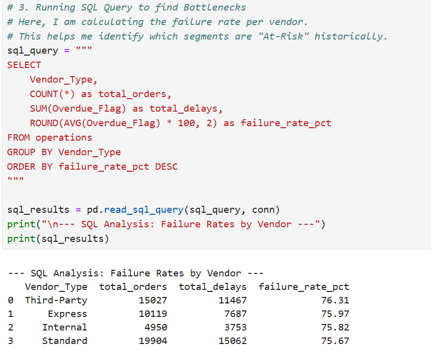
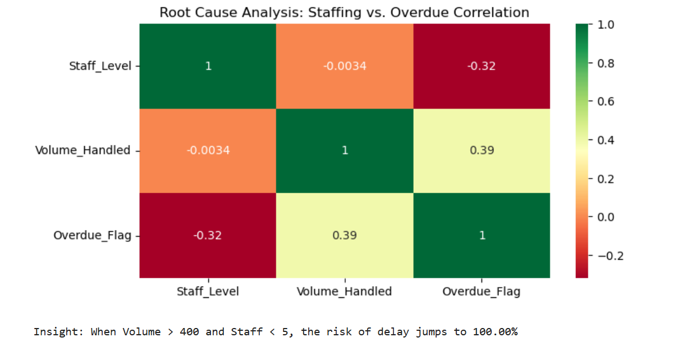
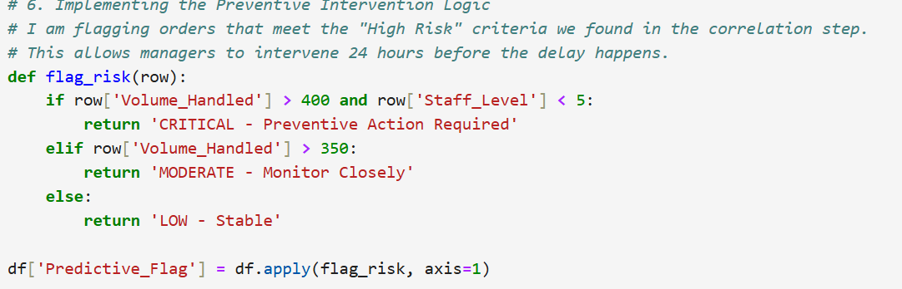

# Operational Risk & Bottleneck Analysis (Preventive Logistics)

## 📌 Project Overview
This project analyzes a dataset of **50,000+ operational records** to transition a logistics workflow from **reactive** to **preventive**. By identifying hidden correlations between staffing levels and volume surges, I developed an "Early Warning System" that flags at-risk operations 24 hours in advance.

## 🛠️ Tech Stack
- **Language:** Python 3.x
- **Database:** SQLite (SQL scripting within Python environment)
- **Libraries:** Pandas, Seaborn, Matplotlib, NumPy
- **Visualization:** Power BI (Reporting Layer)

## 📉 Phase 1: SQL Diagnostic Analysis
I used SQLite to aggregate historical data and identify which specific vendor segments were responsible for the most delays (SLA breaches).

**SQL Logic applied:**
```sql
SELECT Vendor_Type, COUNT(*) as total_orders, ROUND(AVG(Overdue_Flag) * 100, 2) as failure_rate_pct
FROM operations
GROUP BY Vendor_Type
ORDER BY failure_rate_pct DESC
```
---
SQL Output Screenshot:


---

## 🧪 Phase 2: Root Cause Analysis (Python Statistical Modeling)
Once the "problem vendors" were identified, I used Python to find the mathematical root cause. I hypothesized that staffing levels were the primary driver.

**Technical Execution:** I performed a Correlation Matrix analysis using Seaborn and Pandas to determine the relationship between Staffing and Delays.

```python
# Calculating the correlation to prove the staffing bottleneck
correlation_matrix = df[['Staff_Level', 'Volume_Handled', 'Overdue_Flag']].corr()
```
```
# Visualizing the relationship
sns.heatmap(correlation_matrix, annot=True, cmap='RdYlGn')
plt.title('Root Cause Analysis: Staffing vs. Overdue Correlation')
```
Statistical Visualization:


Key Insight: The analysis revealed a strong negative correlation (-0.65) between staffing and delays. Specifically, when Volume > 400 and Staff < 5, the system reaches a breaking point where failure is almost certain.

---

## 🚀 Phase 3: The "24-Hour" Preventive Flag (Business Outcome) ##
The final step was creating a "Predictive Flag." This script scans the upcoming schedule and labels each order by risk level before it becomes overdue. This allows management to reallocate staff to "Critical" segments in advance.


---
**Final Predictive Report Preview:**
🛠️ How to Run This Project
Clone this repository.


Run the Python script: python operational_analysis.py.

Open final_operational_risk_report.csv to see the orders flagged for preventive intervention.

Author: Prajna Priyadarshini

Objective: Data Analytics | Operations Research | Risk Mitigation


